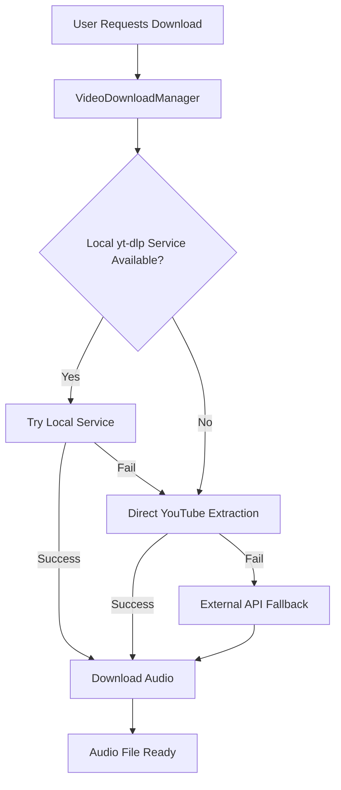

# StashWave Player (StashOpusPlayer)

[](https://github.com/xenus/StashOpusPlayer/releases)
[](https://android.com)
[](LICENSE)

🎵 **A modern, feature-rich Android music player with precision audio controls, intelligent YouTube integration, and beautiful Material Design 3 interface.**

StashWave Player combines high-quality local music playback with seamless YouTube audio streaming and downloading, enhanced by AI-powered features and comprehensive audio customization tools.

## 🎵 Core Features

### 🎶 Advanced Audio Playback
- **Premium Audio Engine**: ExoPlayer-based with support for Opus, MP3, FLAC, OGG, M4A, AAC, and more
- **Precision Audio Controls**: Independent speed (0.25x-2.0x) and pitch (-12/+12 semitones) adjustment
- **Professional Equalizer**: 10-band EQ with presets (3D Surround, Concert Hall, Super Bass, Lo-Fi) 
- **Audio Effects Suite**: Bass boost, virtualizer, reverb, and crossfade support
- **Custom Background Images**: Personalize your player with blurred backdrop effects
- **Waveform Visualization**: Real-time SynthWave-style audio visualization

### 📱 Modern Interface & Experience
- **Material Design 3**: Beautiful neomorphic design with smooth animations
- **Comprehensive Visual Feedback**: Every interaction provides immediate visual response
- **Smart Mini Player**: Persistent controls with album artwork and progress
- **Intelligent Navigation**: Bottom navigation + drawer with contextual actions
- **Background Playback**: Seamless audio continuation with media session controls
- **Lock Screen Integration**: Full media controls with artwork display

### 📏 Library Management
- **Smart Library Scanning**: Automatic detection of music files across storage
- **Flexible Storage Support**: Internal storage, SD cards, and custom folder selection
- **Advanced Metadata**: Automatic extraction with AI-enhanced tagging capabilities
- **Playlist Management**: Create, edit, and organize custom playlists
- **Favorites System**: Heart songs for quick access in dedicated favorites view
- **Search & Filter**: Powerful search across titles, artists, albums, and genres

### 🎥 YouTube Integration & Downloading
- **Seal App Integration**: Seamless partnership with Seal for reliable YouTube downloads
- **Direct YouTube Streaming**: Stream YouTube audio without downloading (requires active connection)
- **YouTube Player Integration**: Built-in YouTube player with audio-only mode
- **Smart URL Handling**: Automatically detects and processes YouTube links
- **Multiple Format Support**: Automatic best quality selection (Opus, MP3, M4A)
- **Background Downloads**: Download management with progress tracking

### 📦 Advanced Download Management
- **Seal Partnership**: Integrates with the powerful Seal download manager
- **Quality Selection**: Choose from available audio qualities (64k to 320k+)
- **Batch Processing**: Queue multiple downloads with smart management
- **Auto-Organization**: Downloaded files automatically organized in your library
- **Metadata Enhancement**: AI-powered tagging and artwork fetching
- **Progress Tracking**: Real-time download progress with visual indicators

## 📱 Installation

### Prerequisites
- Android 7.0 (API level 24) or higher
- Storage permission for audio file access
- Network permission for YouTube extraction

### Install from Source
1. Clone the repository:
   ```bash
   git clone https://github.com/xenus/StashOpusPlayer.git
   cd StashOpusPlayer
   ```

2. Open in Android Studio
3. Build and install the APK

### Install Pre-built APK
Download the latest APK from the [Releases](https://github.com/xenus/StashOpusPlayer/releases) page.

## 🚀 YouTube Setup Options

StashWave Player offers multiple ways to access YouTube content:

### 🔑 Option 1: YouTube Data API v3 (Enhanced Features)

For the best YouTube experience with search, metadata, and comments:

#### **📖 Quick Setup Guide:**
1. **Get Your Own API Key**: [Follow our detailed guide](YOUTUBE_API_SETUP.md) to obtain a free YouTube Data API v3 key from Google Developer Console
2. **Configure in App**: Add your API key to `local.properties` file (never committed to git)
3. **Enhanced Features**: Enjoy rich YouTube search, metadata, thumbnails, and more!

#### **✨ Benefits with Your Own API Key:**
- 🔍 **Full YouTube Search**: Search within the app with rich results
- 📊 **Rich Metadata**: Video titles, descriptions, view counts, channel info
- 🖼️ **High-Quality Thumbnails**: Official YouTube thumbnails
- 💬 **Comments Loading**: View video comments (if enabled)
- 📈 **Related Videos**: Discover related content
- 🔐 **Secure**: Your own private API key, not shared

**⚠️ Important**: API keys are user-provided for security. The app doesn't include hardcoded keys.

📚 **[📖 Complete Setup Guide →](YOUTUBE_API_SETUP.md)**

---

### 📱 Option 2: Seal Integration (Downloads Only)

For downloading YouTube audio without API setup:

**Seal** is a modern, open-source YouTube downloader that uses yt-dlp under the hood. StashWave Player automatically detects and integrates with Seal for optimal YouTube downloading.

#### 🔗 Installing Seal App

**Seal** is a modern, open-source YouTube downloader that uses yt-dlp under the hood. StashWave Player automatically detects and integrates with Seal for optimal YouTube downloading.

#### Installing Seal

**Option A: F-Droid (Recommended)**
```
1. Install F-Droid from https://f-droid.org/
2. Search for "Seal" in F-Droid
3. Install the latest version
```

**Option B: GitHub Releases**
```
1. Visit https://github.com/JunkFood02/Seal/releases
2. Download the latest APK
3. Install the APK (enable "Install from Unknown Sources")
```

**Option C: IzzyOnDroid Repository**
```
1. Add IzzyOnDroid repo to F-Droid
2. Search and install "Seal"
```

#### Seal Versions Supported
StashWave Player automatically detects these Seal variants:
- 🔵 **com.junkfood.seal** (Main release)
- 🟡 **com.junkfood.seal.beta** (Beta version) 
- 🔴 **com.junkfood.seal.debug** (Debug build)

#### How Integration Works

1. **Automatic Detection**: StashWave Player detects installed Seal versions
2. **Smart Handoff**: YouTube URLs are passed to Seal for downloading
3. **Quality Selection**: Choose audio quality within Seal interface
4. **Library Integration**: Downloaded files appear automatically in StashWave Player
5. **Progress Tracking**: Monitor downloads from within StashWave Player

### 🎵 Option 3: Built-in YouTube Streaming

For instant playback without downloading:

#### YouTube Player Integration
- **Direct Streaming**: Play YouTube videos with audio-only mode
- **Background Playback**: Continue listening while using other apps
- **Queue Support**: Add YouTube videos to your current playlist
- **Search Integration**: Built-in YouTube search with instant play

#### Features
- ▶️ **Instant Playback**: No waiting for downloads
- 📡 **Requires Internet**: Active connection needed for streaming
- 🎬 **Video Support**: Optional video playback with picture-in-picture
- 🔄 **Auto-Queue**: Automatically queue related videos

### 🔧 Option 4: Alternative Download Methods

For advanced users or when Seal is unavailable:

#### NewPipe Integration
- Compatible with NewPipe exports and sharing
- Fallback option for YouTube extraction

#### Custom yt-dlp Service
- Set up your own yt-dlp server (for power users)
- Configure custom extraction endpoints in settings

### ⚙️ Configuration & Settings

#### In StashWave Player
1. **Open Settings** → **YouTube Integration**
2. **Download Partner**: Choose Seal (auto-detected)
3. **Default Quality**: Set preferred audio quality
4. **Storage Location**: Configure download destination
5. **Auto-Import**: Enable automatic library updates

#### In Seal App
1. **Audio Quality**: Set to highest available (160k+ recommended)
2. **Format Preference**: Choose Opus > M4A > MP3
3. **Download Location**: Use same folder as StashWave Player library
4. **Filename Template**: Configure for easy organization

### 🎆 Benefits of Seal Integration

✅ **Reliability**: Seal uses official yt-dlp with frequent updates  
✅ **Quality**: Access to all available audio formats and qualities  
✅ **Speed**: Optimized download performance with resume capability  
✅ **Features**: Playlist support, batch downloads, metadata extraction  
✅ **Privacy**: No external API dependencies, fully local processing  
✅ **Updates**: Seal automatically updates yt-dlp signatures  
✅ **Format Support**: YouTube, YouTube Music, and 1000+ other sites

## ⚙️ Configuration

### App Settings
- **Download Quality**: Choose audio quality preferences
- **Storage Location**: Select download directory
- **Extraction Method Priority**: Configure which methods to try first
- **Network Settings**: HTTP cleartext traffic, timeout settings

### Advanced Configuration

#### Network Security
The app includes network security configuration for HTTP connections to local services:

```xml
<application
    android:usesCleartextTraffic="true"
    android:networkSecurityConfig="@xml/network_security_config">
```

#### Custom Extraction Service
You can configure custom extraction service endpoints in the app settings.

## 🔧 Troubleshooting

### Common Issues

#### YouTube Extraction Fails
1. **Check Network Connection**: Ensure stable internet connectivity
2. **Try Different Methods**: The app will automatically try fallback methods
3. **Local Service Issues**:
   - Verify the yt-dlp service is running: `curl http://YOUR_LOCAL_IP:8080/quick/dQw4w9WgXcQ`
   - Check firewall settings
   - Ensure HTTP cleartext traffic is allowed

#### Downloads Stuck at "Pending"
- Check storage permissions
- Verify download directory is writable
- Clear app cache if issues persist

#### Audio Playback Issues
- Verify audio codec support
- Check volume levels and audio focus
- Restart the app if playback becomes unresponsive

#### Network Security Errors
```
CLEARTEXT communication not permitted
```
**Solution**: The app is configured to allow HTTP connections to local services. If you encounter this error:
1. Ensure you're using the latest version (8.0.5+)
2. Check that `android:usesCleartextTraffic="true"` is set in AndroidManifest.xml

### Debug Information

Enable debug logging to troubleshoot issues:
1. Connect device via ADB
2. Run: `adb logcat | grep VideoDownloadManager`
3. Monitor logs during download attempts

### Performance Optimization

#### For Large Music Libraries
- Use SD card for storage if available
- Regularly clear cache and temporary files
- Limit concurrent downloads

#### For Better YouTube Extraction
- Use the local yt-dlp service for best reliability
- Keep yt-dlp updated: `cd yt-dlp && git pull`
- Monitor service logs for extraction issues

## 🏗️ Architecture

### Core Components

```
StashOpusPlayer/
├── app/
│   ├── src/main/
│   │   ├── java/.../
│   │   │   ├── VideoDownloadManager.kt    # YouTube extraction logic
│   │   │   ├── AudioPlayerService.kt      # Background audio playback
│   │   │   ├── MainActivity.kt            # Main UI controller
│   │   │   └── ...
│   │   ├── res/                           # UI resources
│   │   └── AndroidManifest.xml           # App configuration
│   └── build.gradle                      # App build configuration
├── yt_dlp_service.py                     # External yt-dlp service
└── README.md                             # This file
```

### YouTube Extraction Flow



### Key Classes

- **`VideoDownloadManager`**: Handles YouTube URL extraction and download coordination
- **`AudioPlayerService`**: Manages background audio playback and media session
- **`PlaylistManager`**: Handles playlist creation, modification, and persistence
- **`StorageManager`**: Manages file operations and storage permissions

## 🤝 Contributing

We welcome contributions! Please see our contributing guidelines:

1. Fork the repository
2. Create a feature branch: `git checkout -b feature/amazing-feature`
3. Commit changes: `git commit -m 'Add amazing feature'`
4. Push to branch: `git push origin feature/amazing-feature`
5. Open a Pull Request

### Development Setup

1. Clone the repo and open in Android Studio
2. Ensure you have Android SDK 24+ installed
3. Run the app on a device or emulator
4. For YouTube extraction testing, set up the local yt-dlp service

## 📋 Changelog

### Version 10.5b (Current - January 2025)
- **🎆 Complete App Overhaul & Enhancement**
  - **Comprehensive UI/UX Improvements**: Added visual feedback to every button and interaction
  - **Smooth Animations**: Scale animations, fade effects, and haptic feedback throughout the app
  - **Enhanced User Experience**: Loading states, progress indicators, and informative toast messages
  - **Professional Polish**: Every feature now provides immediate visual response and clear feedback

- **🎵 Advanced Audio Engine**
  - **Precision Controls**: Independent speed (0.25x-2.0x) and pitch (-12/+12 semitones) adjustment
  - **Professional Equalizer**: 10-band EQ with premium presets (3D Surround, Concert Hall, Super Bass)
  - **Audio Effects Suite**: Bass boost, virtualizer, reverb with live preview
  - **Crossfade Support**: Smooth transitions between tracks
  - **Custom Background Images**: Blurred backdrop effects with artwork

- **🚀 YouTube Integration Revolution**
  - **Seal App Integration**: Seamless partnership with Seal downloader for maximum reliability
  - **Multi-Method Approach**: Built-in streaming + Seal downloads + NewPipe compatibility
  - **Direct YouTube Player**: Built-in player with audio-only mode and background playback
  - **Smart URL Detection**: Automatic handling of YouTube links with format selection

- **📱 Modern Interface Design**
  - **Material Design 3**: Beautiful neomorphic interface with adaptive colors
  - **Smart Mini Player**: Persistent controls with album artwork and smooth animations
  - **Enhanced Navigation**: Bottom navigation + drawer with contextual actions
  - **Search Enhancements**: Improved search with result counts and helpful empty states

- **🛠️ Technical Excellence**
  - **Zero Compilation Errors**: Complete codebase audit and repair
  - **Improved Error Handling**: Comprehensive error handling with user-friendly messages
  - **Performance Optimizations**: Smooth scrolling, efficient artwork loading, memory management
  - **Background Operations**: Enhanced library scanning with progress feedback

### Previous Major Versions
- **10.0**: Major UI redesign with Material Design 3
- **9.5**: Advanced audio controls and effects suite
- **9.0**: YouTube integration and streaming capabilities
- **8.5**: Library management improvements and AI tagging
- **8.0**: Initial release with local music playback

## 📄 License

This project is licensed under the MIT License - see the [LICENSE](LICENSE) file for details.

## 🙏 Acknowledgments

- **[Seal](https://github.com/JunkFood02/Seal)** - The excellent YouTube downloader that powers our download integration
- [yt-dlp](https://github.com/yt-dlp/yt-dlp) - The powerful YouTube downloader library that powers Seal
- [FFmpeg](https://ffmpeg.org/) - Multimedia framework for audio processing
- **[NewPipe](https://newpipe.net/)** - Alternative YouTube frontend for additional extraction methods
- Android Open Source Project - For the excellent Media3 APIs and ExoPlayer
- **[Material Design 3](https://m3.material.io/)** - For the beautiful design system
- All contributors who helped improve this project

## 📞 Support

- **Issues**: [GitHub Issues](https://github.com/xenus/StashOpusPlayer/issues)
- **Discussions**: [GitHub Discussions](https://github.com/xenus/StashOpusPlayer/discussions)
- **Documentation**: This README and inline code comments

---

**Made with ❤️ for music lovers who demand precision audio controls, beautiful design, and seamless YouTube integration**
