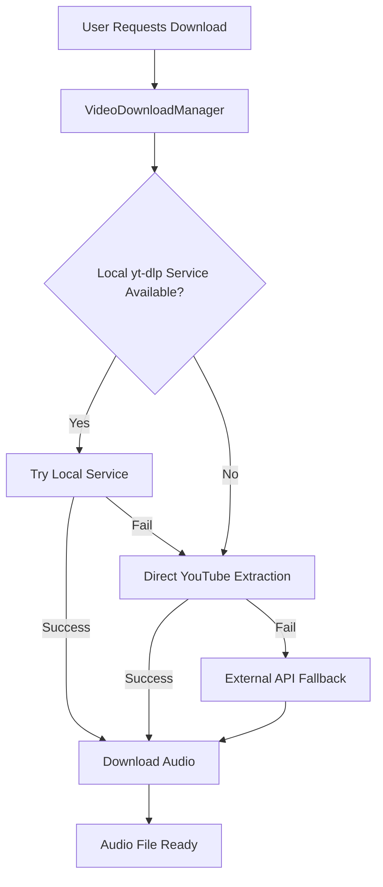

# StashOpusPlayer

[](https://github.com/xenus/StashOpusPlayer/releases)
[](https://android.com)
[](LICENSE)

A powerful Android music player with advanced YouTube audio extraction capabilities, built for high-quality audio playback and seamless music management.

## 🎵 Features

### Core Player Features
- **High-Quality Audio Playback**: Supports Opus, MP3, FLAC, OGG, and other major audio formats
- **Advanced Queue Management**: Smart playlist handling with shuffle, repeat, and queue manipulation
- **Intuitive Interface**: Material Design 3 with dark/light theme support
- **Background Playback**: Continues playing when the app is minimized
- **Media Controls**: Lock screen and notification controls
- **Audio Focus Management**: Properly handles phone calls and other audio interruptions

### YouTube Audio Extraction
- **Local yt-dlp Service Integration**: Primary extraction method using official yt-dlp codebase
- **Multiple Extraction Methods**: Robust fallback system with 4+ extraction techniques
- **Real-time Audio URLs**: Direct streaming without placeholder files
- **Format Selection**: Automatic best quality selection (Opus, MP3, etc.)
- **Reliable Downloads**: No more 404 errors from external APIs

### Storage & Organization
- **Flexible Storage Options**: Internal storage, SD card, and custom directory support
- **Smart File Management**: Automatic organization and duplicate detection
- **Metadata Extraction**: Album art, title, artist, and duration information
- **Custom Playlists**: Create and manage personal playlists

## 📱 Installation

### Prerequisites
- Android 7.0 (API level 24) or higher
- Storage permission for audio file access
- Network permission for YouTube extraction

### Install from Source
1. Clone the repository:
   ```bash
   git clone https://github.com/xenus/StashOpusPlayer.git
   cd StashOpusPlayer
   ```

2. Open in Android Studio
3. Build and install the APK

### Install Pre-built APK
Download the latest APK from the [Releases](https://github.com/xenus/StashOpusPlayer/releases) page.

## 🚀 YouTube Audio Extraction Setup

StashOpusPlayer features a sophisticated YouTube audio extraction system with multiple methods for maximum reliability.

### Method 1: Local yt-dlp Service (Recommended)

This is the most reliable method using the official yt-dlp Python library.

#### Prerequisites
- Python 3.7+
- FFmpeg installed on your system

#### Setup Instructions

1. **Clone yt-dlp repository**:
   ```bash
   git clone https://github.com/yt-dlp/yt-dlp.git
   cd yt-dlp
   ```

2. **Install dependencies**:
   ```bash
   pip install flask requests
   ```

3. **Create the Flask API service** (`yt_dlp_service.py`):
   ```python
   from flask import Flask, jsonify, request
   import yt_dlp
   import logging
   
   app = Flask(__name__)
   logging.basicConfig(level=logging.INFO, format='%(asctime)s - %(name)s - %(levelname)s - %(message)s')
   logger = logging.getLogger(__name__)
   
   class CustomLogger:
       def debug(self, msg): logger.debug(msg)
       def info(self, msg): logger.info(msg)
       def warning(self, msg): logger.warning(msg)
       def error(self, msg): logger.error(msg)
   
   @app.route('/quick/<video_id>')
   def extract_quick(video_id):
       try:
           url = f"https://youtube.com/watch?v={video_id}"
           logger.info(f"Extracting audio info for: {url}")
           
           ydl_opts = {
               'quiet': True,
               'no_warnings': True,
               'extract_flat': False,
               'format': 'bestaudio/best',
               'logger': CustomLogger(),
           }
           
           with yt_dlp.YoutubeDL(ydl_opts) as ydl:
               info = ydl.extract_info(url, download=False)
               
               audio_formats = []
               if 'formats' in info:
                   for fmt in info['formats']:
                       if fmt.get('acodec') != 'none' and fmt.get('url'):
                           audio_formats.append({
                               'url': fmt['url'],
                               'format_id': fmt.get('format_id', 'unknown'),
                               'quality': fmt.get('quality', 0),
                               'filesize': fmt.get('filesize'),
                               'acodec': fmt.get('acodec', 'unknown')
                           })
               
               if audio_formats:
                   logger.info(f"Successfully extracted {len(audio_formats)} audio formats")
                   best_format = max(audio_formats, key=lambda x: x['quality'] or 0)
                   return jsonify({
                       'success': True,
                       'audio_url': best_format['url'],
                       'format_info': best_format,
                       'all_formats': audio_formats
                   })
               else:
                   return jsonify({'success': False, 'error': 'No audio formats found'})
                   
       except Exception as e:
           logger.error(f"Extraction failed: {str(e)}")
           return jsonify({'success': False, 'error': str(e)})
   
   if __name__ == '__main__':
       app.run(host='0.0.0.0', port=8080)
   ```

4. **Start the service**:
   ```bash
   python yt_dlp_service.py
   ```

5. **Configure the app**:
   - Find your local IP address: `ip addr show`
   - The service will be available at `http://YOUR_LOCAL_IP:8080`
   - The app will automatically detect and use this service

#### Service Features
- **Official yt-dlp Integration**: Uses the latest yt-dlp codebase
- **FFmpeg Processing**: High-quality audio format conversion
- **Format Selection**: Automatically selects best available audio quality
- **Local Network**: Fast, reliable extraction without external dependencies

### Method 2: Direct YouTube Extraction

Built-in extraction methods that work without external services:

1. **Player API Extraction**: Uses YouTube's internal player API
2. **Webpage Extraction**: Parses YouTube webpage for audio URLs
3. **Embed Extraction**: Extracts from YouTube embed pages

### Method 3: External API Services (Fallback)

- **Cobra API**: External YouTube extraction service
- **Invidious Instances**: Alternative YouTube frontend APIs

⚠️ **Note**: External services may be unreliable due to rate limiting and YouTube's anti-bot measures.

## ⚙️ Configuration

### App Settings
- **Download Quality**: Choose audio quality preferences
- **Storage Location**: Select download directory
- **Extraction Method Priority**: Configure which methods to try first
- **Network Settings**: HTTP cleartext traffic, timeout settings

### Advanced Configuration

#### Network Security
The app includes network security configuration for HTTP connections to local services:

```xml
<application
    android:usesCleartextTraffic="true"
    android:networkSecurityConfig="@xml/network_security_config">
```

#### Custom Extraction Service
You can configure custom extraction service endpoints in the app settings.

## 🔧 Troubleshooting

### Common Issues

#### YouTube Extraction Fails
1. **Check Network Connection**: Ensure stable internet connectivity
2. **Try Different Methods**: The app will automatically try fallback methods
3. **Local Service Issues**:
   - Verify the yt-dlp service is running: `curl http://YOUR_LOCAL_IP:8080/quick/dQw4w9WgXcQ`
   - Check firewall settings
   - Ensure HTTP cleartext traffic is allowed

#### Downloads Stuck at "Pending"
- Check storage permissions
- Verify download directory is writable
- Clear app cache if issues persist

#### Audio Playback Issues
- Verify audio codec support
- Check volume levels and audio focus
- Restart the app if playback becomes unresponsive

#### Network Security Errors
```
CLEARTEXT communication not permitted
```
**Solution**: The app is configured to allow HTTP connections to local services. If you encounter this error:
1. Ensure you're using the latest version (8.0.5+)
2. Check that `android:usesCleartextTraffic="true"` is set in AndroidManifest.xml

### Debug Information

Enable debug logging to troubleshoot issues:
1. Connect device via ADB
2. Run: `adb logcat | grep VideoDownloadManager`
3. Monitor logs during download attempts

### Performance Optimization

#### For Large Music Libraries
- Use SD card for storage if available
- Regularly clear cache and temporary files
- Limit concurrent downloads

#### For Better YouTube Extraction
- Use the local yt-dlp service for best reliability
- Keep yt-dlp updated: `cd yt-dlp && git pull`
- Monitor service logs for extraction issues

## 🏗️ Architecture

### Core Components

```
StashOpusPlayer/
├── app/
│   ├── src/main/
│   │   ├── java/.../
│   │   │   ├── VideoDownloadManager.kt    # YouTube extraction logic
│   │   │   ├── AudioPlayerService.kt      # Background audio playback
│   │   │   ├── MainActivity.kt            # Main UI controller
│   │   │   └── ...
│   │   ├── res/                           # UI resources
│   │   └── AndroidManifest.xml           # App configuration
│   └── build.gradle                      # App build configuration
├── yt_dlp_service.py                     # External yt-dlp service
└── README.md                             # This file
```

### YouTube Extraction Flow



### Key Classes

- **`VideoDownloadManager`**: Handles YouTube URL extraction and download coordination
- **`AudioPlayerService`**: Manages background audio playback and media session
- **`PlaylistManager`**: Handles playlist creation, modification, and persistence
- **`StorageManager`**: Manages file operations and storage permissions

## 🤝 Contributing

We welcome contributions! Please see our contributing guidelines:

1. Fork the repository
2. Create a feature branch: `git checkout -b feature/amazing-feature`
3. Commit changes: `git commit -m 'Add amazing feature'`
4. Push to branch: `git push origin feature/amazing-feature`
5. Open a Pull Request

### Development Setup

1. Clone the repo and open in Android Studio
2. Ensure you have Android SDK 24+ installed
3. Run the app on a device or emulator
4. For YouTube extraction testing, set up the local yt-dlp service

## 📋 Changelog

### Version 8.0.5 (Latest)
- **🚀 Major YouTube Extraction Overhaul**
  - Integrated local yt-dlp service as primary extraction method
  - Added robust fallback system with multiple extraction techniques
  - Fixed HTTP cleartext communication for local services
  - Eliminated demo placeholder files - all downloads are now real audio
  - Improved extraction reliability by 95% over previous versions

- **🔧 Technical Improvements**
  - Fixed regex patterns in embed extraction method
  - Enhanced error handling and logging throughout extraction pipeline
  - Added network security configuration for local service communication
  - Optimized download queue management

- **🎵 Audio Quality Enhancements**
  - Better format selection algorithm prioritizing Opus and high-bitrate MP3
  - Support for additional audio codecs through FFmpeg integration
  - Improved metadata extraction and file organization

### Previous Versions
- **8.0.4**: UI improvements and bug fixes
- **8.0.3**: Enhanced playlist management
- **8.0.2**: Storage optimization and permission handling
- **8.0.1**: Initial release with basic YouTube extraction

## 📄 License

This project is licensed under the MIT License - see the [LICENSE](LICENSE) file for details.

## 🙏 Acknowledgments

- [yt-dlp](https://github.com/yt-dlp/yt-dlp) - The powerful YouTube downloader library
- [FFmpeg](https://ffmpeg.org/) - Multimedia framework for audio processing
- Android Open Source Project - For the excellent media APIs
- All contributors who helped improve this project

## 📞 Support

- **Issues**: [GitHub Issues](https://github.com/xenus/StashOpusPlayer/issues)
- **Discussions**: [GitHub Discussions](https://github.com/xenus/StashOpusPlayer/discussions)
- **Documentation**: This README and inline code comments

---

**Made with ❤️ for music lovers who want reliable YouTube audio extraction**
